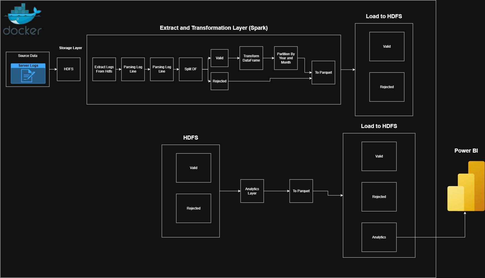

# Architecture

## Overview

The project implements a local batch data-engineering architecture for processing Nginx web-server access logs.



The pipeline follows this logical flow:

```text
Raw Nginx Logs
      ↓
     HDFS
      ↓
Apache Spark
  ├── Parsing
  ├── Validation
  └── Transformation
      ↓
 ┌───────────────┐
 │               │
Valid          Rejected
 │               │
 ↓               ↓
Parquet        Parquet
 │
 ↓
Spark Analytics
 ↓
Analytics Parquet
 ↓
WebHDFS
 ↓
Power BI
```

## Components

### Hadoop HDFS

HDFS is used as the storage layer for:

- Raw logs
- Processed valid records
- Rejected records
- Analytics outputs

### Apache Spark

Spark is responsible for:

- Reading raw logs
- Parsing records
- Applying validation rules
- Transforming valid records
- Writing Parquet output
- Producing analytical aggregations

### Parquet

Parquet is the storage format for structured processed and analytical data.

It provides a columnar representation suitable for analytical workloads.

### Snappy

Snappy compression is used for the processed Parquet output.

### Docker

Docker provides the local Hadoop/Spark environment used during development.

### WebHDFS

WebHDFS exposes HDFS through HTTP so that external clients such as Power BI can access the stored analytics files.

### Power BI

Power BI is the presentation layer for the final analytics datasets.

## Data Zones

The project separates data logically into:

1. Raw input
2. Processed valid data
3. Rejected data
4. Analytics data
