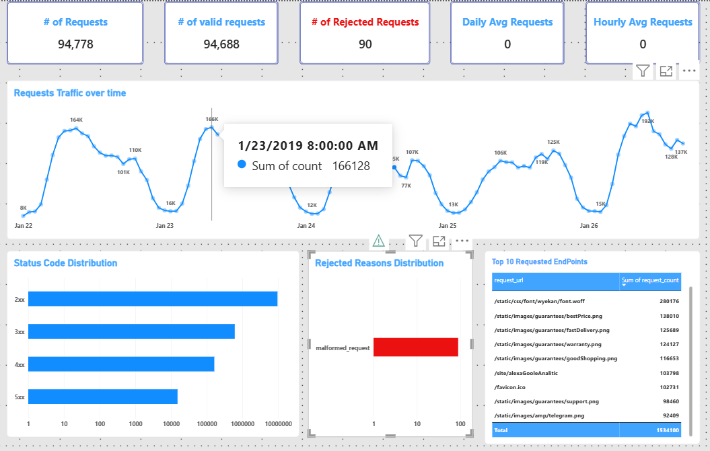

# Power BI Integration

## Overview

The final analytics datasets are consumed in Power BI directly from HDFS through the Hadoop File (HDFS) connector.

The local environment uses WebHDFS to expose HDFS through HTTP.

## Connection

The NameNode WebHDFS endpoint used by the local setup is:

```text
localhost:9870
```

The HDFS RPC port is different:

```text
9000
```

Port `9000` is used for HDFS client/RPC communication and is not the WebHDFS HTTP endpoint used by Power BI.

## Connection Flow

The Power BI connection works conceptually as:

```text
Power BI
   ↓
localhost:9870
   ↓
NameNode WebHDFS
   ↓
DataNode
   ↓
Parquet file
```

## Selecting Analytics Data

The analytics directory is:

```text
/log-processing/analytics
```

It contains:

```text
request_volume_hourly
status_class_counts
status_code_counts
top_endpoints
top_rejected_reasons
```

The relevant Parquet files are selected in Power Query and imported into the Power BI model.

## Local DataNode Hostname Resolution

During local development, WebHDFS redirected file reads to the Docker DataNode hostname.

The Docker hostname was not automatically resolvable by Windows.

The local Windows environment was therefore configured so that the DataNode hostname could be resolved by the Power BI client.

This is a development-environment workaround.

It should not be treated as the architecture for a production Hadoop deployment.

## Large Parquet File Handling

Some analytics outputs, especially the endpoint-level dataset, are larger than the other aggregate outputs.

When Power Query treats a WebHDFS file as a streamed binary value, `Parquet.Document` can fail.

Buffering the binary before passing it to `Parquet.Document` can resolve this situation:

```powerquery
Parquet.Document(
    Binary.Buffer(<Parquet binary>)
)
```

The exact Power Query step depends on the generated file and query structure.

## Dashboard



The dashboard presents the analytical outputs in a visual form, including:

- Request volume over time
- HTTP status distribution
- Individual status-code counts
- Top endpoints
- Rejected-record reasons

## Design Principle

The Power BI layer is intentionally connected to the analytics layer rather than the raw logs.

Spark performs the data-intensive processing and aggregation, while Power BI focuses on analysis and visualization.
